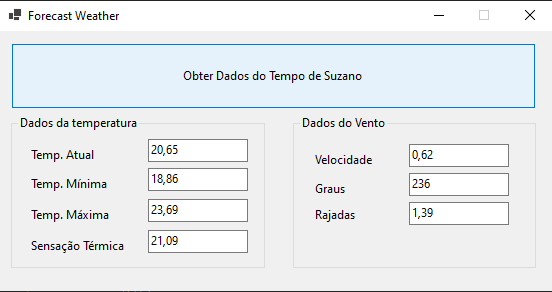

# Forecast Weather Station
## Projeto trás a previsão do tempo
Projeto motivado pelo estudo do Design Pattern Observer

O objetivo principal é definir uma dependência um-para-muitos entre objetos para que quando o estado de um objeto mude todos seus dependentes são avisados e atualizados automaticamente.



## Tecnologias utilizadas

- Dotnet 7
- Windows Forms para UI
- xUnit 
- https://openweathermap.org/ para trazer informações do tempo

## Boas práticas e padrões utilizados

- Solid
- Clean Code
- Observer Pattern

## Configuração Necessária

- Criar o arquivo appsetting.json na raiz do projeto
- Definir as variáveis "openweathermap:api_key", como abaixo:

```sh
{
  "openweathermap": {
    "api_key": "SUA_KEY_DO_OPENWEATHERMAP"
  }
}
```

## Melhorias que podem ser empregadas

- [x] Implementar a interface gráfica
- [ ] Definir no README como definir a url para consulta
- [ ] Permitir selecionar outra cidade além de Suzano

## Referências

- Use a Cabeça Padrões de Projeto

## License

MIT

**Free Software, Hell Yeah!**
